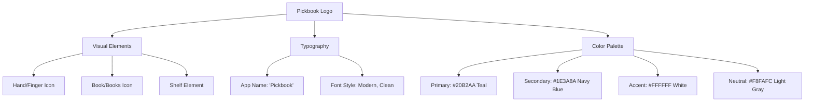

# Pickbook Logo Design & Implementation Plan

## Design Concept
- **App Name**: Pickbook
- **Purpose**: Digital library app for reading and organizing personal book collections
- **Style**: Playful design combining a book with a "pick" element (hand picking a book from shelf)
- **Color Scheme**: Modern tech colors - Teal (#20B2AA) and Navy Blue (#1E3A8A)
- **Target**: Complete app icon package + scalable SVG for UI use

## Logo Design Elements

### Visual Components


### Icon Concept
1. **Main Symbol**: A stylized hand/finger pointing or reaching toward a book
2. **Book Representation**: Simple, recognizable book shape with subtle details
3. **Shelf Element**: Minimal shelf line or books arranged to suggest selection
4. **Composition**: Circular or rounded square format suitable for app icons

### Color Strategy
- **Primary Teal**: `#20B2AA` - Main brand color, represents technology and innovation
- **Navy Blue**: `#1E3A8A` - Secondary color, represents trust and knowledge
- **White**: `#FFFFFF` - Clean contrast and text
- **Light Gray**: `#F8FAFC` - Subtle backgrounds and shadows
- **Dark Gray**: `#334155` - Text and details when needed

### Typography
- **Primary Font**: Modern, clean sans-serif (professional yet approachable)
- **Style**: Clean, legible, contemporary character spacing
- **Weight**: Medium to bold for visibility at small sizes

## Implementation Plan

### Phase 1: SVG Logo Creation
1. **Master SVG Design** (scalable vector format)
   - Full logo with text and icon
   - Icon-only version
   - Horizontal layout version
   - Vertical layout version
   - Light and dark theme variants

### Phase 2: App Icon Generation
1. **Android Icons** (multiple densities)
   - `mipmap-mdpi/ic_launcher.png` (48x48)
   - `mipmap-hdpi/ic_launcher.png` (72x72)
   - `mipmap-xhdpi/ic_launcher.png` (96x96)
   - `mipmap-xxhdpi/ic_launcher.png` (144x144)
   - `mipmap-xxxhdpi/ic_launcher.png` (192x192)

2. **iOS Icons** (AppIcon.appiconset)
   - Icon-App-20x20@1x.png (20x20)
   - Icon-App-20x20@2x.png (40x40)
   - Icon-App-20x20@3x.png (60x60)
   - Icon-App-29x29@1x.png (29x29)
   - Icon-App-29x29@2x.png (58x58)
   - Icon-App-29x29@3x.png (87x87)
   - Icon-App-40x40@1x.png (40x40)
   - Icon-App-40x40@2x.png (80x80)
   - Icon-App-40x40@3x.png (120x120)
   - Icon-App-60x60@2x.png (120x120)
   - Icon-App-60x60@3x.png (180x180)
   - Icon-App-76x76@1x.png (76x76)
   - Icon-App-76x76@2x.png (152x152)
   - Icon-App-83.5x83.5@2x.png (167x167)
   - Icon-App-1024x1024@1x.png (1024x1024)

3. **Web Icons**
   - `favicon.png` (32x32)
   - `Icon-192.png` (192x192)
   - `Icon-512.png` (512x512)
   - `Icon-maskable-192.png` (192x192)
   - `Icon-maskable-512.png` (512x512)

4. **macOS Icons**
   - app_icon_16.png (16x16)
   - app_icon_32.png (32x32)
   - app_icon_64.png (64x64)
   - app_icon_128.png (128x128)
   - app_icon_256.png (256x256)
   - app_icon_512.png (512x512)
   - app_icon_1024.png (1024x1024)

5. **Windows Icons**
   - `app_icon.ico` (multiple sizes embedded: 16, 32, 48, 256)

### Phase 3: Flutter Integration
1. **Assets Setup**
   - Create `assets/images/logo/` directory
   - Add SVG logo files
   - Update `pubspec.yaml` with asset declarations

2. **Logo Widget Creation**
   - Reusable `PickbookLogo` widget component
   - Different size variants (small, medium, large)
   - Light/dark theme support
   - Animation capabilities

3. **Splash Screen Integration**
   - Update splash screen with new logo
   - Animated logo entrance
   - Proper sizing and positioning

4. **Theme Updates**
   - Update app theme colors to match new brand
   - Update `constants.dart` with new color scheme
   - Ensure UI consistency

### Phase 4: Platform Configuration
1. **Replace Default Icons**
   - Update all platform-specific icon files
   - Ensure proper naming conventions
   - Test icon visibility across platforms

2. **Manifest Updates**
   - Update app names and descriptions
   - Ensure icon references are correct
   - Update theme colors in platform configs

## File Structure Plan

```
pick_book/
├── assets/
│   └── images/
│       └── logo/
│           ├── pickbook_logo_full.svg
│           ├── pickbook_logo_horizontal.svg
│           ├── pickbook_logo_vertical.svg
│           ├── pickbook_icon.svg
│           ├── pickbook_logo_light.svg
│           └── pickbook_logo_dark.svg
├── android/app/src/main/res/
│   ├── mipmap-mdpi/ic_launcher.png
│   ├── mipmap-hdpi/ic_launcher.png
│   ├── mipmap-xhdpi/ic_launcher.png
│   ├── mipmap-xxhdpi/ic_launcher.png
│   └── mipmap-xxxhdpi/ic_launcher.png
├── ios/Runner/Assets.xcassets/AppIcon.appiconset/
│   ├── Icon-App-20x20@1x.png
│   ├── Icon-App-29x29@1x.png
│   └── (all iOS icon sizes)
├── web/
│   ├── favicon.png
│   └── icons/
│       ├── Icon-192.png
│       ├── Icon-512.png
│       ├── Icon-maskable-192.png
│       └── Icon-maskable-512.png
├── macos/Runner/Assets.xcassets/AppIcon.appiconset/
│   ├── app_icon_16.png
│   ├── app_icon_32.png
│   └── (all macOS icon sizes)
└── windows/runner/resources/
    └── app_icon.ico
```

## Design Specifications

### Logo Variations
1. **Full Logo**: Icon + "Pickbook" text (for splash screens, headers)
2. **Icon Only**: Just the book-picking symbol (for app icons)
3. **Horizontal**: Icon left, text right (for navigation bars)
4. **Vertical**: Icon top, text bottom (for compact spaces)

### Color Usage Guidelines
- **Teal (#20B2AA)**: Primary brand color, main icon elements
- **Navy Blue (#1E3A8A)**: Secondary elements, text, shadows
- **White (#FFFFFF)**: Backgrounds, contrast elements
- **Light Gray (#F8FAFC)**: Subtle backgrounds, disabled states

### Accessibility Considerations
- High contrast ratios for text readability
- Clear visual hierarchy
- Scalable design that works at all sizes
- Alternative text descriptions for screen readers

## Success Criteria
- ✅ Logo clearly represents "picking books" concept
- ✅ Modern tech aesthetic with teal and navy blue colors
- ✅ Scales perfectly from 16x16 to 1024x1024
- ✅ Works well on light and dark backgrounds
- ✅ All platform icons properly implemented
- ✅ SVG logo integrated into Flutter app
- ✅ Professional, contemporary appearance
- ✅ Consistent brand identity across all touchpoints

## Next Steps
1. Create master SVG logo design
2. Generate all required icon sizes
3. Implement Flutter assets and widgets
4. Update app theme colors
5. Replace platform-specific icons
6. Test across all target platforms
7. Document usage guidelines

---

**Ready to proceed with implementation using the modern teal and navy blue color scheme!**